# System Architecture

This document outlines the architecture of the Kartikey Portfolio AI project, including its structure, major components, data flow, and key design decisions.

## 1. Overview

The project is a modern single-page application (SPA) built with React and Vite. It serves as a personal portfolio showcasing projects, skills, and experience, enhanced with an AI chatbot and dynamic blog integration. The architecture relies heavily on client-side rendering, leveraging external APIs and serverless functions for backend capabilities.

```mermaid
graph LR
    User["👤 User Browser"] -- Interacts --> Frontend["⚛️ React Frontend (Vite)"]

    Frontend -- "Views/Clicks" --> ReactRouter["React Router"]
    Frontend -- "State/UI" --> FramerMotion["Framer Motion"]
    Frontend -- "Styling" --> TailwindCSS["Tailwind CSS"]

    Frontend -- "Contact Form" --> EmailJS["✉️ EmailJS API"]
    Frontend -- "Blog View" --> HashnodeService["hashnodeService.js"]
    HashnodeService -- "GraphQL Query" --> HashnodeAPI["🌐 Hashnode API"]

    Frontend -- "Chat Message" --> SupabaseClient["Supabase Client Lib"]
    SupabaseClient -- "Invoke Function" --> SupabaseEdgeFunc["⚡️ Supabase Edge Function (chatbot)"]
    SupabaseClient -- "Read/Write (Optional)" --> SupabaseDB["🐘 Supabase DB (chat_sessions)"]

    SupabaseEdgeFunc -- "API Call" --> GeminiAPI["🤖 Google Gemini AI API"]
    SupabaseEdgeFunc -- "Read/Write" --> SupabaseDB

    EmailJS -- "Sends Email" --> Recipient["📬 Recipient Email"]
    HashnodeAPI -- "Blog Data" --> HashnodeService
    GeminiAPI -- "AI Response" --> SupabaseEdgeFunc
    SupabaseDB -- "Chat History" --> SupabaseEdgeFunc
    SupabaseEdgeFunc -- "Chat Reply/History" --> SupabaseClient

    style Frontend fill:#61DAFB,stroke:#61DAFB,color:#fff
    style ReactRouter fill:#CA4245,stroke:#CA4245,color:#fff
    style FramerMotion fill:#9C27B0,stroke:#9C27B0,color:#fff
    style TailwindCSS fill:#38BDF8,stroke:#38BDF8,color:#fff
    style EmailJS fill:#f56565,stroke:#f56565,color:#fff
    style HashnodeAPI fill:#2962FF,stroke:#2962FF,color:#fff
    style HashnodeService fill:#2962FF,stroke:#2962FF,color:#fff
    style SupabaseClient fill:#3ECF8E,stroke:#3ECF8E,color:#fff
    style SupabaseEdgeFunc fill:#3ECF8E,stroke:#3ECF8E,color:#fff
    style SupabaseDB fill:#3ECF8E,stroke:#3ECF8E,color:#fff
    style GeminiAPI fill:#4285F4,stroke:#4285F4,color:#fff
```



## 2. Folder Structure

```
kartikey-portfolio-ai/
├── public/               # Static assets (favicon, manifest)
├── src/
│   ├── App.jsx           # Main application component with routing setup
│   ├── index.css         # Main CSS entry point (imports Tailwind)
│   ├── main.jsx          # Application entry point, initializes React & EmailJS
│   ├── supabaseClient.js # Initializes Supabase client library
│   ├── components/       # Reusable UI components (layout, features)
│   │   ├── features/     # Components specific to portfolio sections (About, Contact, Hero, etc.)
│   │   │   ├── chatbot/  # Chatbot specific components and context
│   │   │   └── three/    # React Three Fiber components (ParticleField)
│   │   └── layout/       # Layout components (Navbar, PageContainer, ThemeToggle)
│   ├── data/             # Static data (project details)
│   ├── hooks/            # Custom React hooks (useTheme)
│   ├── pages/            # Page-level components corresponding to routes
│   ├── services/         # Modules for interacting with external APIs (EmailJS, Hashnode)
│   └── styles/           # Styling configuration (Tailwind base, theme, CSS utils)
├── supabase/             # Supabase specific configuration and functions
│   ├── config.toml       # Supabase project config
│   └── functions/        # Edge Functions code
│       ├── _shared/      # Shared code for functions (CORS headers)
│       ├── browser-with-cors/ # Example function
│       └── chatbot/      # Chatbot backend logic (index.ts, deno.json)
├── .env                  # Environment variables (local only, gitignored)
├── index.html            # Main HTML template for Vite
├── package.json          # Project dependencies and scripts
├── vite.config.js        # Vite build configuration
├── tailwind.config.js    # Tailwind CSS configuration
└── README.md             # Project Readme
```

- **`src/components`**: Contains reusable UI pieces. Further divided into `layout` (page structure like Navbar) and `features` (components making up specific sections like `About`, `Projects`, `Chatbot`).
- **`src/pages`**: Top-level components rendered by React Router for each main section/page of the portfolio.
- **`src/services`**: Handles communication with external APIs (EmailJS, Hashnode). Isolates API logic.
- **`src/hooks`**: Custom React hooks to encapsulate reusable logic (e.g., `useTheme`).
- **`src/data`**: Static data used within the application, like project details.
- **`src/styles`**: Centralized styling configuration, including Tailwind base styles, theme variables, and utility class definitions.
- **`supabase/functions`**: Contains the backend logic for serverless functions, primarily the chatbot interaction with Gemini AI.

## 3. Major Components

- **React Frontend (Vite Build):**
  - Renders the user interface using React components.
  - Handles client-side routing with `react-router-dom`.
  - Manages component state and application-wide state (e.g., theme).
  - Initiates API calls to external services (EmailJS, Hashnode) and Supabase Functions.
  - Built using Vite for fast development and optimized production builds.
- **Styling System:**
  - **Tailwind CSS:** Provides utility classes for rapid UI development. Configured with custom theme variables (`tailwind.config.js`, `src/styles/theme.js`).
  - **CSS Variables:** Used for theming (dark/light mode) defined in `src/styles/tailwind.css`.
  - **CSS Modules:** Used for scoping styles specific to complex components like the Chatbot (`chatbot.module.css`).
  - **Framer Motion:** Library used for implementing animations and page transitions.
- **EmailJS Integration:**
  - `src/services/emailService.js` initializes and uses the EmailJS SDK.
  - Handles sending contact form data directly from the client to the EmailJS service, which then relays it as an email.
- **Hashnode Integration:**
  - `src/services/hashnodeService.js` queries the Hashnode GraphQL API.
  - Fetches blog post list and individual post content for display in the `/blog` sections.
- **Supabase Integration:**
  - **Chatbot Edge Function (`supabase/functions/chatbot`):**
    - Acts as a secure backend endpoint for the chatbot.
    - Receives user messages and context from the frontend.
    - Calls the Google Gemini AI API using a securely stored API key (Supabase Secrets).
    - Processes the AI response and returns it to the frontend.
    - Handles CORS for browser invocation.
    - Potentially interacts with Supabase DB to store/retrieve chat session history.
  - **Supabase Database:**
    - Stores chat session data (e.g., in a `chat_sessions` table) to maintain conversation context within a session.

## 4. Data Flow

- **Page Load:** React app loads, router displays the relevant page component, static data (`projectsData.js`) is used directly, theme is loaded from `localStorage`.
- **Contact Form Submission:**
  1.  User fills the form (`Contact.jsx`).
  2.  `react-hook-form` validates input.
  3.  On submit, `onSubmit` calls `sendEmail` in `emailService.js`.
  4.  `sendEmail` uses EmailJS SDK to send data to EmailJS API.
  5.  EmailJS sends an email to the configured recipient.
  6.  Success/error status is shown to the user.
- **Blog Viewing:**
  1.  User navigates to `/blog` or `/blog/:slug`.
  2.  The corresponding page component (`BlogList.jsx` or `BlogPost.jsx`) mounts.
  3.  `useEffect` triggers a call to `hashnodeService.js`.
  4.  `hashnodeService.js` sends a GraphQL query to the Hashnode API.
  5.  Hashnode API returns post data.
  6.  Data is stored in component state and rendered.
- **Chatbot Interaction:**
  1.  User types a message in `Chatbot.jsx`.
  2.  On send, the component calls `supabase.functions.invoke('chatbot', ...)` via `supabaseClient.js`.
  3.  The message and `resumeContext.js` content are sent in the request body.
  4.  The request hits the Supabase Edge Function (`chatbot/index.ts`).
  5.  The Edge Function retrieves the `GEMINI_API_KEY` secret.
  6.  The Edge Function calls the Gemini AI API with the message, context, and API key.
  7.  (Optional) The Edge Function might query/update the Supabase DB (`chat_sessions`) for history.
  8.  Gemini AI API returns a text response.
  9.  The Edge Function formats the reply and sends it back to the client.
  10. `Chatbot.jsx` receives the reply and updates the chat display.

## 5. Key Design Decisions

- **Vite:** Chosen for its fast development server startup and build times compared to Create React App.
- **Tailwind CSS:** Selected for rapid UI development using utility classes and easy customization for theming.
- **Framer Motion:** Integrated for creating fluid and engaging animations and page transitions, enhancing user experience.
- **Client-Side Focus:** Most logic resides in the frontend, minimizing the need for a complex custom backend.
- **Serverless for Backend Needs:**
  - **EmailJS:** Offloads the complexity of email sending.
  - **Supabase Edge Functions:** Provides a scalable, secure serverless environment for the chatbot logic, keeping API keys off the client and enabling interaction with the Gemini API. Edge functions offer potentially lower latency.
- **Headless CMS/API for Content:**
  - **Hashnode:** Leveraged as a headless CMS for blog content, separating content management from the portfolio codebase.
- **Component Structure:** Organized components into `layout` and `features` for better maintainability and separation of concerns.
- **Custom Hooks:** Used (`useTheme`) to abstract reusable logic and stateful behavior.
- **AI Integration:** Gemini AI via Supabase Functions provides an advanced interactive element (chatbot) without managing AI models directly.
